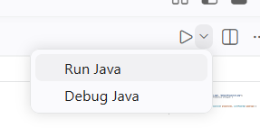
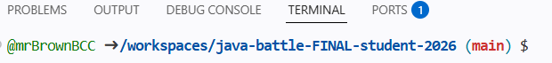

# Java Battle

Welcome to your final project! All of your skills will be tested - 2D arrays, working with other classes, and debugging your code. 

Your goal is to program the smartest robot possible. 

## How to work on this project

1. Just run the code, and look at the myRobot class and the Rando class. Run a sample battle to see what functioning robots will look like.
2. Set your stats and robot name!
3. Attempt to beat the rock. Use the super simple map.  
4. See if you can get your robot moving around. 
5. Test against robot 1. To select it, click "Test Robots" to switch to "Player Robots" in the robot selection screen. 
6. Modify your robot, test it, and continously beat the levels of enemy robots. Show Mr. Brown as you beat new robots. 
7. Keep improving your robot until June 15. At this point, all robots will be added into one version of the game, and we will have a tournament bracket. 


### Accessing your code

All your code will go into MyRobot.java. To access this file, navigate using:

src > main > java > app > robots > MyRobot.java

To run your code, click the triangle in the top right of the screen that will appear while you are in any java file. 




As a first step, you should choose your stats! The sum of all stats need to be 10. For reference, the Robot class constructor header looks like this:

```
 public Robot(int x, int y, int healthPoints, int speedPoints, int attackSpeedPoints, int projectileStrengthPoints, String robotName, String imageName, String projectileImageName) {
```

This entire project, you are only coding 2 places. The constructor of MyRobot, and the think method of MyRobot. 

### Opening the GUI

To open the GUI, take a look at the bottom of the screen. You should see a navigation bar with PROBLEMS, OUTPUT, DEBUG CONSOLE, TERMINAL, and PORTS. 



Click on PORTS. 

Hover over the forwarded address, and click the globe option that says "open in browser". 

In this new tab, you will see "NoVNC", click the "Connect" button below it. 

### Examples

For examples,  take a look at Rock and Rando. Both of these robots are in the robots folders. All other robots have their source code hidden. 

### Project Slides

[Here](https://docs.google.com/presentation/d/11qoqh2Q24R_AvI8jFQyexTA0K9FZNU-x7zve_oHooNI/edit?usp=sharing)

### Adding Images

To add an image, upload a png file to resources > images. Then, in your call to the Robot constructor, change the image name. 

### Grading

Grading is different for this project. As you reach different milestones, call Mr. Brown over and show your robot beating the different levels. He will mark down on paper. Grades will be entered on June 11. 

50% - code compiles

60% - beat level 1

70% - beat level 2

80% - beat level 3

90% - beat level 4

100% - beat level 5

### Competition Submission
To submit your code for the competition, you must submit by June 15 at 10:30AM (so Mr. Brown can set up the tournament on the 15th after class).

Run the following command in the terminal:

```
git add . 
git commit -m "submitting"
git push
```
